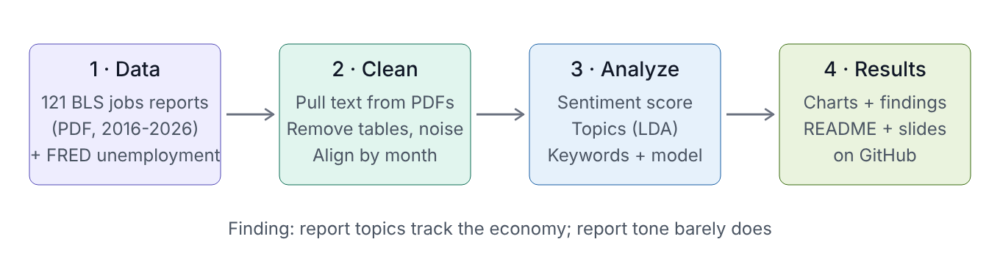
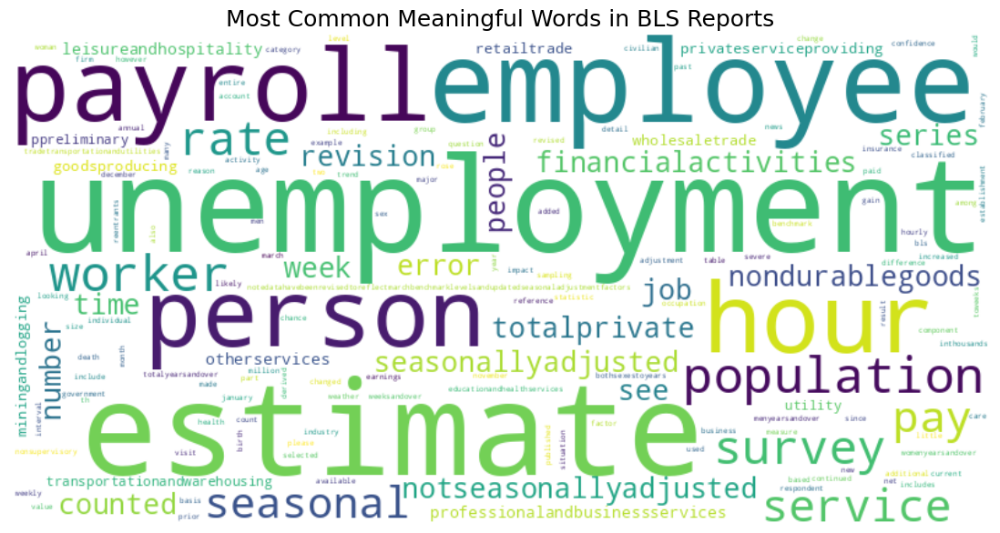
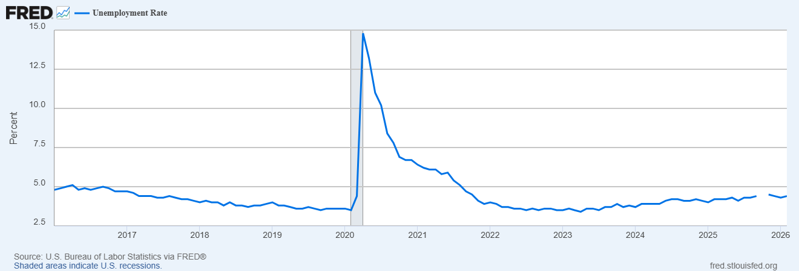

# Reading the Labor Market: Text Analytics of BLS Employment Reports

> **Does the language of the U.S. Bureau of Labor Statistics' monthly jobs report reflect real labor-market conditions?**
> An NLP project over **121 BLS *Employment Situation* releases (Jan 2016 – Feb 2026)**, compared with the FRED unemployment rate.

*DSC 785 Text Analytics, Adelphi University, Spring 2026. Final group project (team of four).*

**My contribution:** I designed the project's end-to-end architecture and built the analysis pipelines: PDF text extraction and cleaning (stop-word filtering, lemmatisation), TF-IDF keyword analysis, and LDA topic modelling across 121 BLS reports.

## At a glance

| | |
|---|---|
| **Data** | 121 monthly BLS PDF reports (`bls_reports/`) and the FRED unemployment rate series (`UNRATE.csv`) |
| **Methods** | Text extraction, cleaning and lemmatising, word frequency, TF-IDF, TextBlob sentiment, LDA topic modelling, logistic regression |
| **Stack** | Python, pandas, pdfplumber, NLTK, scikit-learn, gensim, TextBlob, matplotlib, WordCloud (Google Colab) |
| **Deliverables** | Analysis notebook, slide deck, charts |
| **Headline** | Report **topics** track the economic regime (COVID, remote work). Report **tone** barely tracks unemployment |

## What we found

**1. The reports are formulaic, and the vocabulary shows it.** The most frequent meaningful terms are *unemployment, estimate, employee, payroll, hour, population, worker, survey, rate*. Sentiment polarity stays in a narrow, mildly positive band (about 0.01 to 0.06 on a −1 to +1 scale), because the BLS writes in deliberately neutral language.

**2. Sentiment drifts, but does not follow the unemployment spike.** Report sentiment stays between roughly 0.02 and 0.06 through 2016 to 2022, peaks in mid-2020, then trends down from 2023 onward. The unemployment rate meanwhile jumped to 14.8% in April 2020 and fell back by 2022, a shock the wording barely registers.

**3. Topics tell the story that tone doesn't.** LDA separates a *manufacturing / production* theme from a *pandemic employment impact* theme and a *remote work and pandemic* theme (the slide deck has the topic words).

**Follow-up check (separate re-analysis).** Re-running the analysis with reports matched to the unemployment series by month, the sentiment correlation was *r* = +0.21 overall (driven by the COVID spike), *r* = −0.22 once Mar-2020 to Dec-2021 is excluded, and about zero against month-to-month changes. A simple text-only classifier for "did unemployment rise?" did no better than a majority-class baseline (56.7% accuracy on 30 held-out months). Takeaway: report tone is a weak signal; report topics are the stronger one.

## How it works

1. **Collect.** 121 monthly *Employment Situation* PDFs from the BLS plus the monthly unemployment rate from FRED.
2. **Clean.** Pull text from each PDF, lowercase, strip numbers and punctuation, remove standard and BLS-specific stop-words (boilerplate, table and month words), lemmatise.
3. **Analyse.** Word frequency and a word cloud, TF-IDF keyword weights, TextBlob sentiment polarity per report, LDA topic modelling (4 topics), and a logistic regression on TF-IDF features.
4. **Compare and present.** Sentiment against the FRED unemployment rate, plus a slide deck summarising the approach.

## Repository contents

| File | What it is |
|---|---|
| `GroupProject-BLSReports-sentiment-analysis.ipynb` | Full analysis notebook (Colab) |
| `Text Analytics.pptx` | Project slide deck |
| `bls_reports/` | The 121 BLS *Employment Situation* PDFs |
| `UNRATE.csv` | FRED monthly unemployment rate |
| `BLS-workflow.png` | Workflow diagram |
| `wordCloudBlsReports.png`, `sentiment analysis polarity plot.png`, `fredgraph-stLouisFed.png` | Charts used above |

## Run it

1. Open the notebook in Google Colab.
2. Upload `bls_reports/` and `UNRATE.csv` to a Google Drive folder and update the folder paths in the first cells to match.
3. Run all cells. Mounting Drive asks for your own Google sign-in.

## Limitations and next steps

* TextBlob is a general-purpose lexicon. A finance/economics lexicon (Loughran-McDonald) or a fine-tuned transformer is the natural upgrade.
* In the notebook, the sentiment-vs-unemployment overlay pairs reports with unemployment by row position. It should join on the report month, because the October 2025 unemployment value is missing (federal shutdown).
* The logistic regression label is derived from the same sentiment score, so its accuracy is not a true prediction test. A better target is the real change in unemployment, evaluated on a time-ordered split.
* With 121 documents, results are indicative rather than conclusive. Next steps are to add CPI and payrolls as targets and test whether language leads the data.